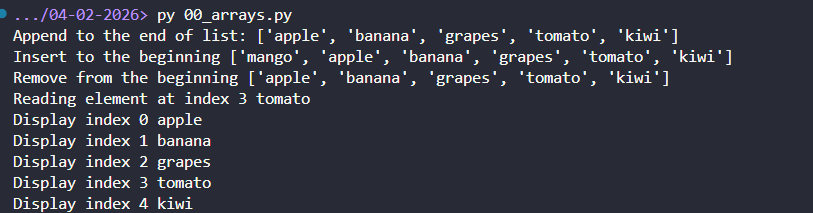

# Screenshots of DSA Implementations

| # | Data Structure / Algorithm | Status |
|---|---------------------------|--------|
| 1 | Arrays Basics | ✅ Done |
| 2 | Strings Basics | ⏳ Pending |
| 3 | Sets Usage | ⏳ Pending |
| 4 | Hashmap Basics | ⏳ Pending |
| 5 | Frequency Map | ⏳ Pending |
| 6 | Two Sum | ⏳ Pending |
| 7 | Two Pointers (Opposite Direction) | ⏳ Pending |
| 8 | Two Pointers (Same Direction) | ⏳ Pending |
| 9 | Valid Palindrome | ⏳ Pending |
| 10 | Middle of Linked List | ⏳ Pending |
| 11 | Sliding Window (Fixed) | ⏳ Pending |
| 12 | Sliding Window (Dynamic) | ⏳ Pending |
| 13 | Max Subarray of Size K | ⏳ Pending |
| 14 | Longest Substring Without Repeating | ⏳ Pending |
| 15 | Binary Search (Basic) | ⏳ Pending |
| 16 | Binary Search (First True) | ⏳ Pending |
| 17 | Find First True | ⏳ Pending |
| 18 | Binary Search (Rotated Array) | ⏳ Pending |
| 19 | Find Min in Rotated Array | ⏳ Pending |
| 20 | BFS (Tree) | ⏳ Pending |
| 21 | BFS (Graph) | ⏳ Pending |
| 22 | Binary Tree Level Order Traversal | ⏳ Pending |
| 23 | Flood Fill | ⏳ Pending |

# 1. Arrays Basics

Displayed a basic list of fruits and showed how to read through, append, remove from array

