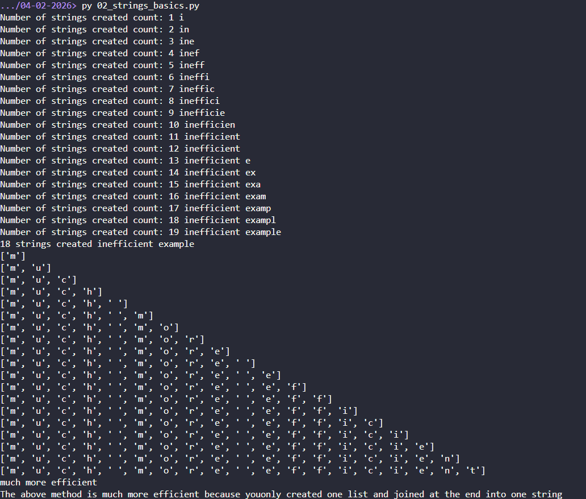
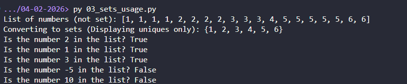

# Screenshots of DSA Implementations

| **#** | **Data Structure / Algorithm** | **File Name** | **Status** |
|---|---------------------------|-----------|--------|
| 1 | Arrays Basics | `01_arrays_basics.py` | ✅ Done |
| 2 | Strings Basics | `02_strings_basics.py` | ✅ Done |
| 3 | Sets Usage | `03_sets_usage.py` | ✅ Done |
| 4 | Hashmap Basics | `04_hashmap_basics.py` | ✅ Done |
| 5 | Two Pointers | `05_two_pointers.py` | ⏳ Pending |
| 6 | Sliding Window | `06_sliding_window.py` | ⏳ Pending |
| 7 | Binary Search | `07_binary_search.py` | ⏳ Pending |
| 8 | Breadth-First Search (BFS) | `08_bfs.py` | ⏳ Pending |
| 9 | Depth-First Search (DFS) | `09_dfs.py` | ⏳ Pending |
| 10 | Backtracking | `10_backtracking.py` | ⏳ Pending |
| 11 | Priority Queue / Heap | `11_priority_queue_heap.py` | ⏳ Pending |

## 1. Arrays Basics

Displayed a basic list of fruits and showed how to read through, append, remove from array \

## 2. String Bascis

Displayed two examples of inefficient and efficient way to read through and rebuild strings \

## 3. Sets Usage

Displayed a list of numbers and convert to set to check the existence of a set of numbers in it \

## 4. Hashmap Basics

Two problems: \
 1. Hashmap word frequency checker \
 2. Find the index of two numbers in a list that add to a target number  \

