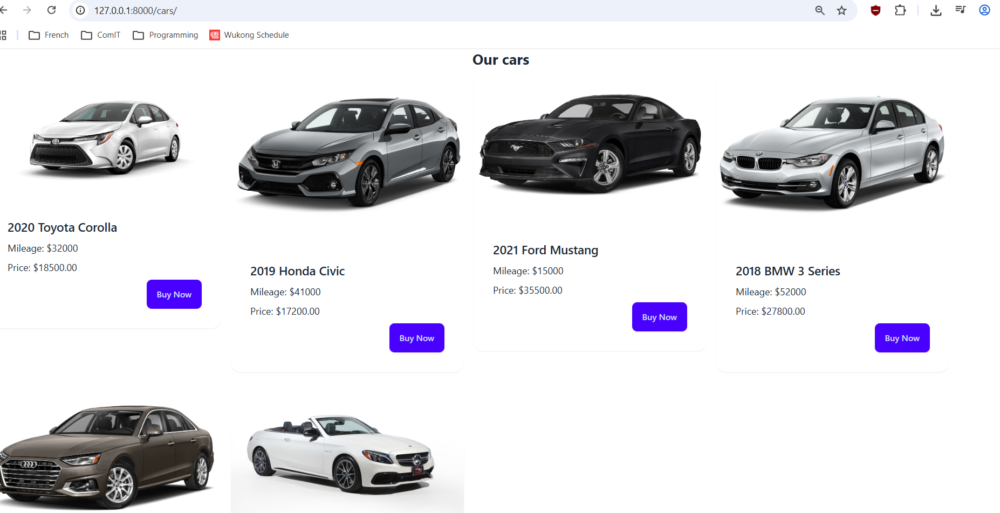

# 🚗 Car Dealership Web Application

A **Django-based web application** for managing and displaying available cars in a dealership.


## 🧰 Tech Stack
  
- Backend: Django (Python)  
- Frontend: HTML + Tailwind CSS + DaisyUI  
- Database: SQLite  
- Image handling: Pillow  


## 🚀 Features

- **Admin Dashboard** – Manage cars (add, edit, delete) via Django admin panel  
- **Cars Page** – Displays available cars dynamically from the database  
- **Image Uploads** – Each car supports image display using Django media handling  
- **Responsive UI** – Built with Tailwind CSS + DaisyUI  
- **MVT Architecture** – Clean Django structure following best practices  


## ⚙️ Data Model

```python
from django.db import models

class Car(models.Model):
    make = models.CharField(max_length=50)
    model = models.CharField(max_length=75)
    gear = models.CharField(max_length=20)
    year = models.IntegerField()
    price = models.DecimalField(max_digits=10, decimal_places=2)
    mileage = models.IntegerField()
    image = models.ImageField(upload_to='cars/', blank=True, null=True)

    def __str__(self):
        return f"{self.make} {self.model} ({self.year})"

# ⚙️ Setup & Installation Guide
```

### 📸 Screenshot

#### Screenshot of cars/ path



Follow these steps to set up and run the project locally.

## 1. Clone the Repository
```python
git clone <your-repo-link>  
cd car-dealership  
```

## 2. Create a Virtual Environment
```python
python -m venv venv  
```


## 3. Activate the Virtual Environment
```python
macOS / Linux:  
source venv/bin/activate  

Windows:  
venv/Scripts/activate  
```

## 4. Install Dependencies
```python
pip install django pillow  

(Optional)  
pip install -r requirements.txt  
```

## 5. Apply Database Migrations
```python
python manage.py makemigrations  
python manage.py migrate  

```

## 6. Create Superuser (Admin Access)
```python
python manage.py createsuperuser  
```
Follow the prompts to create your admin account.


## 7. Run the Development Server
```python
python manage.py runserver  
```


## 8. Access the Application

Main site: http://127.0.0.1:8000/  
Admin panel: http://127.0.0.1:8000/admin/  
Cars: http://127.0.0.1:8000/cars/


## 9. Upload Cars with Images

1. Go to the admin panel  
2. Add a new Car  
3. Fill in details and upload an image  
4. Save  

Make sure the images are saved in the following path:
`project_folder/car_log/media/cars`

## 10. Media Files Setup (Important for Images)

Add this to settings.py:

```python
import os  

MEDIA_URL = '/media/'  
MEDIA_ROOT = os.path.join(BASE_DIR, 'media')  
```

## 11. Configure URLs for Media

Add this to your main urls.py:
```python
from django.conf import settings  
from django.conf.urls.static import static  

if settings.DEBUG:  
    urlpatterns += static(settings.MEDIA_URL, document_root=settings.MEDIA_ROOT)  
```

## ✅ Notes

- Make sure DEBUG = True during development  
- The media/ folder is created automatically when uploading images  
- Images are stored in: media/cars/  
- Restart the server after making changes  